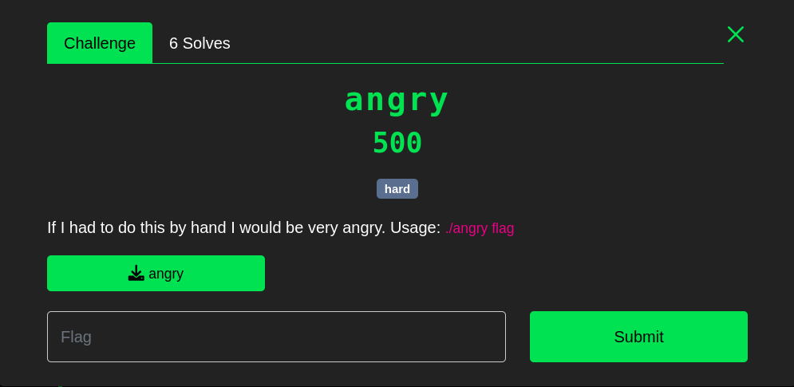
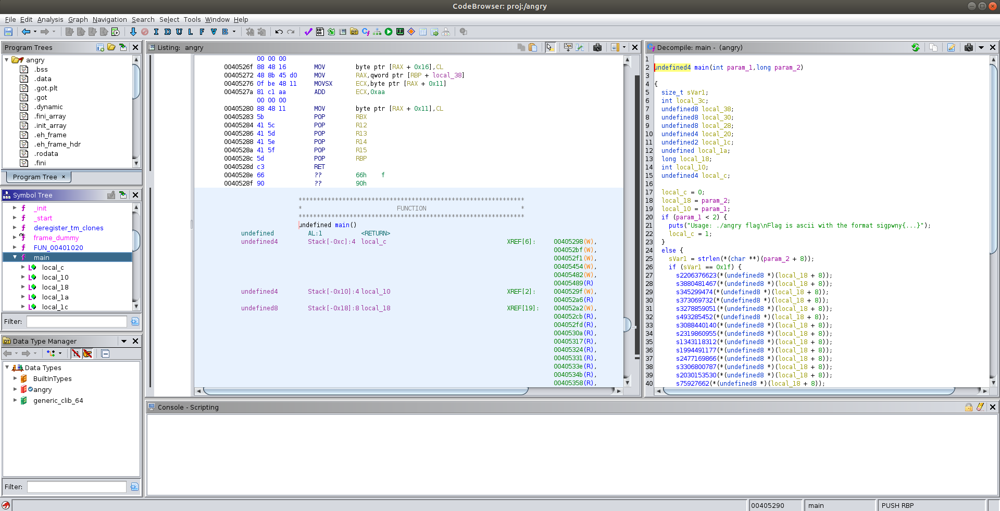

---
_As a beginner of reverse engineering, I spent three days in the spring break to work on a single CTF problem..._

_When trying to solve this_ [CTF problem](https://ctf.sigpwny.com/challenges#Meetings/angry-417), _I learnt three new techniques, angr, Pin, and gdb Python API._

_I'd like to share the approaches I made to solve this CTF problem in this post, hopefully give you an idea of how to deal with some easy reverse engineering problems. This is_ **not** _a tutorial of tools, but a walkthrough of how to analyze the information we gained from these tools. Nevertheless, I will include_ **links to tutorials** _for each tool I used, so that you can easily learn it by yourself._

**(#'O') Spoil Alert: I will introduce my solution to this CTF puzzle in the following post, if you want to figure it out by yourself, you have to stop reading RN :(**

---
# Problem Description
Source: [https://ctf.sigpwny.com/challenges#Meetings/angry-417](https://ctf.sigpwny.com/challenges#Meetings/angry-417)
Difficulty: **hard**
Points: **500**
Download File: [angry](../backup_files/posts/intro-to-re-tools-with-an-angry-example/angry) (I include this here just in case the link to sigpwny website doesn't work)





If you are only interested in the source codes I used to solve this CTF problem checkout my [repo](https://github.com/silkrow/CTF_sigpwny). 
# Start with Ghidra
---
Useful Links:
* [sigpwny presentation for ghidra installation](https://www.youtube.com/watch?v=n8W7ROpvx58)
* [sigpwny presentation for ghidra basic usage](https://www.youtube.com/watch?v=vKuui7iCOB0)
* [ghidra source code on Github](https://github.com/NationalSecurityAgency/ghidra)

---
First thing first, I used ```file``` command in Linux to check the basic information of ```angry```. From the result shown below, I knew ```angry``` was an executable in ELF format, it was **not stripped**, so I could use **gdb** to run it. 

	$ file angry
	angry: ELF 64-bit LSB executable, x86-64, version 1 (SYSV), dynamically linked, interpreter /lib64/ld-linux-x86-64.so.2, BuildID[sha1]=264818a1be1cdd674a24a74ad2ecaffbef7e21b1, for GNU/Linux 3.2.0, not stripped	

Then I used ghidra to further investigate the executable file. Ghidra is developed by **National Security Agency**, written in Java. It provides a **neat GUI to generate guesses of source code base on executable**. 

A typical screenshot of ghidra window is shown below,




## References
1. [https://research.kudelskisecurity.com/2016/08/08/angr-management-first-steps-and-limitations/](https://research.kudelskisecurity.com/2016/08/08/angr-management-first-steps-and-limitations/)
2. [https://book.hacktricks.xyz/reversing-and-exploiting/reversing-tools-basic-methods/angr/angr-examples](https://book.hacktricks.xyz/reversing-and-exploiting/reversing-tools-basic-methods/angr/angr-examples)
3. [https://docs.angr.io/](https://docs.angr.io/)
4. [https://sourceware.org/gdb/onlinedocs/gdb/Python-API.html](https://sourceware.org/gdb/onlinedocs/gdb/Python-API.html)
5. [https://www.youtube.com/watch?v=xt9v5t4_zvE](https://www.youtube.com/watch?v=xt9v5t4_zvE)


--- 
# Drafts

layout:
	angr? 
	basic template
		official doc examples
	problem description
	how to solve it
		length=5 if replace call with hook 
	more angr techniques (2. reference, 1. for python debugging technique)


## How to put multiple inputs received by scanf (should use registers!)
https://book.hacktricks.xyz/reversing-and-exploiting/reversing-tools-basic-methods/angr/angr-examples#registry-values


