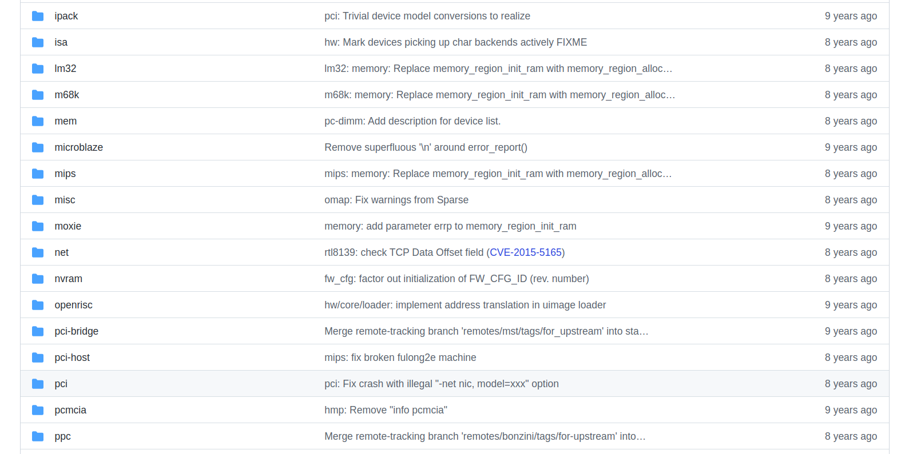
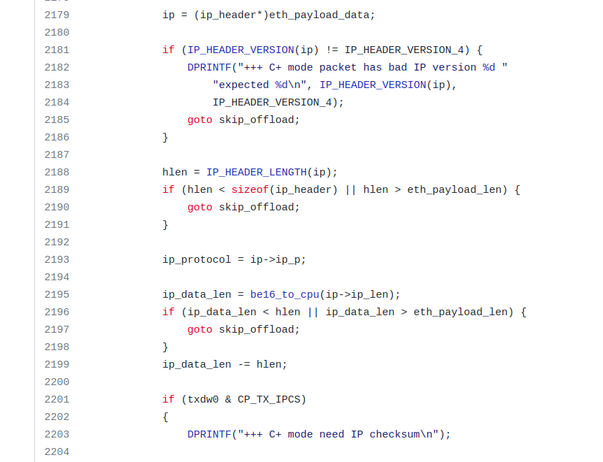

---
*This is a review of the article [VM escape - QEMU Case Study](http://www.phrack.org/issues/70/5.html#article) by Mehdi Talbi and Paul Fariello published on [Phrack](http://www.phrack.org/).*

*This is my first time reading & understanding (a decent portion of) an article related with computer security, so I'd like to write this review to briefly record what I learned from this article.*

---
# Introduction
At HITB 2016, Xu Liu and Shengping Wang from Qihoo 360 have showcased a successful exploit on KVM/QEMU, by exploiting **two vulnerabilities** (CVE-2015-5165 and CVE-2015-7504) present in two different network card device emulator models. 

However, the presentation they gave didn't include the technical details of reproducing the attack, so the Prhack article was written to provide a in-depth analysis of CVE-2015-5165 and CVE-2015-7504, discuss the technical details to exploit the vulnerabilities on QEMU's network card device emulation, and provide generic techniques that could be re-used to exploit future bugs in QEMU.

My review will generally follow the structure of the paper, but I choose to start with a brief outline of the exploit. In the following article, if not otherwise specified, by "they" I refer to the authors of the Phrack article: Mehdi Talbi and Paul Fariello, by "the article" I refer to [VM escape - QEMU Case Study](http://www.phrack.org/issues/70/5.html#article).
# Outline of the Exploit
The exploit makes use of two vulnerabilites present in two different network card device emulator models. CVE-2015-5165 is on network card RTL8139, a memory-leak vulnerability. CVE-2015-7504 is on network card PCNET, a heap-based overflow vulnerability. 

The exploit will first inject payload into memory, including a fake structure and some other codes for the shell.

Then, with CVE-2015-5165, the exploit will find out:
1. The base address of the **.text** segment
2. The base address of the physical memory

use the memory leak to find out the address of the payload. 

Eventually, use CVE-2015-7504 to overwrite a structure on the heap, so that later interrupt handlers for the PCNET network card will be decided by the attacker. The overwritten interrupt handler will first use **mprotect()** to enable the execution bit of certain pages where the payload resides, then trigger **system()** to execute codes in the payload, which brings up a shell in the host machine.
# KVM/QEMU Overview
KVM (Kernal-based Virtual Machine) is a kernel module that provides full
virtualization infrastructure for user space programs. It allows one to run
multiple virtual machines running unmodified Linux or Windows images.

The user space component of KVM is included in mainline QEMU (Quick
Emulator) which **handles especially devices emulation**.
## QEMU Memory Layout
The following figure illustrates how the guest's memory and host's memory
cohabits.
```
Guests processes
                   +--------------------+
Virtual addr space |                    | 
                   +--------------------+
                   |                    |
                    \__   Page Table     \__
                       \                    \
                        |                    |  Guest kernel
                   +----+--------------------+----------------+
Guests phy. memory |    |                    |                |
                   +----+--------------------+----------------+
                   |                                          |
                    \__                                        \__
                       \                                          \
                        |             QEMU process                 |
                   +----+------------------------------------------+
Virtual addr space |    |                                          |
                   +----+------------------------------------------+
                   |                                               |
                    \__                Page Table                   \__
                       \                                               \
                        |                                               |
                   +----+-----------------------------------------------++
Physical memory    |    |                                               ||
                   +----+-----------------------------------------------++
```

As shown in the graph above, **the Guest's phsical memory is actually a mmapp'ed private region in the virtual address of QEMU process**.
                            
Additionaly, QEMU reserves a memory region for BIOS and ROM. These mappings
are available in QEMU's maps file:

	7f1824ecf000-7f1828000000 rw-p 00000000 00:00 0
	7f1828000000-7f18a8000000 rw-p 00000000 00:00 0         [2 GB of RAM]
	7f18a8000000-7f18a8992000 rw-p 00000000 00:00 0
	7f18a8992000-7f18ac000000 ---p 00000000 00:00 0
	7f18b5016000-7f18b501d000 r-xp 00000000 fd:00 262489    [first shared lib]
	7f18b501d000-7f18b521c000 ---p 00007000 fd:00 262489           ...
	7f18b521c000-7f18b521d000 r--p 00006000 fd:00 262489           ...
	7f18b521d000-7f18b521e000 rw-p 00007000 fd:00 262489           ...

	                     ...                                [more shared libs]

	7f18bc01c000-7f18bc5f4000 r-xp 00000000 fd:01 30022647  [qemu-system-x86_64]
	7f18bc7f3000-7f18bc8c1000 r--p 005d7000 fd:01 30022647         ...
	7f18bc8c1000-7f18bc943000 rw-p 006a5000 fd:01 30022647         ...

	7f18bd328000-7f18becdd000 rw-p 00000000 00:00 0         [heap]
	7ffded947000-7ffded968000 rw-p 00000000 00:00 0         [stack]
	7ffded968000-7ffded96a000 r-xp 00000000 00:00 0         [vdso]
	7ffded96a000-7ffded96c000 r--p 00000000 00:00 0         [vvar]
	ffffffffff600000-ffffffffff601000 r-xp 00000000 00:00 0 [vsyscall]  
## Address Translation
There are two layers of translation in QEMU (can be seen in the graph above):
1. guest virtual <-> guest physical
2. guest physical <-> QEMU virtual 
Their exploit involves with guest virtual <-> guest physical when configuring network cards' Tx/Rx buffers (network card needs DMA). On the guest physical <-> QEMU virtual level, their exploit **inject fake structures and get their precise addresses** in QEMU's virtual address space. 

The authors rely on [Nelson Elhage's code](https://github.com/nelhage/virtunoid/blob/master/virtunoid.c) to **convert guest virtual address to guest physical address**.
# CVE-2015-5165 Memory Leak Exploitation
CVE-2015-5165 is a memory leak vulnerability that affects the RTL8139 network card device emulator. They exploit this vulnerability to **leak the memory layout of QEMU** for later exploitation. 

The goal of memory leak is to find:
1. The base address of the **.text** segment **to build the shellcode**.
2. The base address of the physical memory allocated for the guest, in order to get **the precise address of some injected dummy structures**.

Note that from the description above, we can see that they'll inject **shellcode** and **other dummy structures** on different parts of the memory, that's because DEP forces the injection of code and structure to be in their own places.  
## The Vulnerable Code
So, how does the memory leak happen?

REALTEK network card supports two receive/transmit modes: C mode and C+ mode. The vulnerability arises in C+ mode where the NIC device emulator miscalculates the length of IP packet data and ends up **sending more data than actually available in the packet**. Thus the extra data that got sent will be a leak of memory.

In the article, there're snippets of code from **hw/net/rtl8139.c** illustrating this vulnerability. 

	/* ip packet header */
	ip_header *ip = NULL;
	int hlen = 0;
	uint8_t  ip_protocol = 0;
	uint16_t ip_data_len = 0;

	uint8_t *eth_payload_data = NULL;
	size_t   eth_payload_len  = 0;

	int proto = be16_to_cpu(*(uint16_t *)(saved_buffer + 12));
	if (proto == ETH_P_IP)
	{
    	DPRINTF("+++ C+ mode has IP packet\n");

    	/* not aligned */
    	eth_payload_data = saved_buffer + ETH_HLEN;
    	eth_payload_len  = saved_size   - ETH_HLEN;

    	ip = (ip_header*)eth_payload_data;

    	if (IP_HEADER_VERSION(ip) != IP_HEADER_VERSION_4) {
        	DPRINTF("+++ C+ mode packet has bad IP version %d "
            	"expected %d\n", IP_HEADER_VERSION(ip),
            	IP_HEADER_VERSION_4);
        	ip = NULL;
    	} else {
        	hlen = IP_HEADER_LENGTH(ip);
        	ip_protocol = ip->ip_p;
        	ip_data_len = be16_to_cpu(ip->ip_len) - hlen;
		}
	}	
    
In the code above, **hlen** is supposed to be the length of the IP header (20 bytes considering a packet without options), **ip->ip_len** is the total length of the packet including IP header. However, the substraction **ip_data_len = be16_to_cpu(ip->ip_len) - hlen;** assigned **ip_data_len** without checking if **ip->ip_len** is not smaller than **hlen**. So a negative integer can potentially be assigned to **ip_data_len**, note that this variable is of type uint16_t, so the negative int will be later seen as a large unsigned integer. 

The later code snippet is shown below. Note the for loop that uses **tcp_data_len** as boundary, since **tcp_data_len** is calculated by **ip_data_len - tcp_len**, and **ip_data_len** is the overflow integer, **tcp_data_len** can ended up to be around 2^16, such that **memcpy** in the for loop will perform a memory leak. 
```
int tcp_data_len = ip_data_len - tcp_hlen;
int tcp_chunk_size = ETH_MTU - hlen - tcp_hlen;

int is_last_frame = 0;

for (tcp_send_offset = 0; tcp_send_offset < tcp_data_len;
    tcp_send_offset += tcp_chunk_size) {
    uint16_t chunk_size = tcp_chunk_size;

    /* check if this is the last frame */
    if (tcp_send_offset + tcp_chunk_size >= tcp_data_len) {
        is_last_frame = 1;
        chunk_size = tcp_data_len - tcp_send_offset;
    }

    memcpy(data_to_checksum, saved_ip_header + 12, 8);

    if (tcp_send_offset) {
        memcpy((uint8_t*)p_tcp_hdr + tcp_hlen,
                (uint8_t*)p_tcp_hdr + tcp_hlen + tcp_send_offset,
                chunk_size);
    }

    /* more code follows */
}
```
As **saved_ip_header** is something allocated on the heap, the vulnerability exploited above will give us about 64KB of QEMU's heap memory.

The details of how to configure RTL8139 registers to trigger this vulnerability can be found in the paper, I'll not cover them here. 

The interesting part of reading security paper is that you can verify the existance of the vulnerability by yourself. Below is a screenshot of folders in **qemu/hw/** on github [qemu repository, v2.3.1](https://github.com/qemu/qemu/tree/v2.3.1/hw). You can see that there's a commit in **net/** folder about the fix for CVE-2015-5165.



Below is the code snippet in v2.3.1 that fixes the vulnerability. Line 2196 gives the key **if statement**.



## How to Dig Information in Leaked Memory
With their configuration of RTL8139 network card, the leaked memory will be stored in Rx buffers. When analyzing the leaked memory, they found that there were several **function pointers**. 

These function pointers are members of the same QEMU internal structure:
```
typedef struct ObjectProperty
{
    gchar *name;
    gchar *type;
    gchar *description;
    ObjectPropertyAccessor *get;
    ObjectPropertyAccessor *set;
    ObjectPropertyResolve *resolve;
    ObjectPropertyRelease *release;
    void *opaque;

    QTAILQ_ENTRY(ObjectProperty) node;
} ObjectProperty;
```
QEMU uses an object model to manage **devices, memory regions**, etc. At startup, QEMU creates several objects and assigns to them properties. It's likely that these function pointers found on the 64KB leaked memory are from the internal structures of QEMU. So, they search for **80 bytes memory chunks** (the size of **ObjectProperty** structure) where at least one of the function
pointers is set (get, set, resolve or release). So even with ASLR, they could still manage to calculate (i) base address of the **.text** segment, (ii) base address of the physical memory (guest's). 

# CVE-2015-7504 Heap-based Overflow Exploitation
The goal of exploiting CVE-2015-7504 is to use an overflow to **control %rip register**. The vulnerability is related to the AMD PCNET network card emulator. 

## The Vulnerable Code
The code can be found in **hw/net/pcnet.c**. The PCNET device emulator reserves a buffer of 4 kB to store packets. If the ADDFCS flag is enabled on Tx descriptor buffer, the card appends a CRC to received packets. Overflow happens when the received packet itself is already 4096 bytes, in this case CRC will cause an overflow of 4 bytes.
```
uint8_t *src = s->buffer;

/* ... */

if (!s->looptest) {
    memcpy(src, buf, size);
    /* no need to compute the CRC */
    src[size] = 0;
    src[size + 1] = 0;
    src[size + 2] = 0;
    src[size + 3] = 0;
    size += 4;
} else if (s->looptest == PCNET_LOOPTEST_CRC ||
           !CSR_DXMTFCS(s) || size < MIN_BUF_SIZE+4) {
    uint32_t fcs = ~0;
    uint8_t *p = src;

    while (p != &src[size])
        CRC(fcs, *p++);
    *(uint32_t *)p = htonl(fcs);
    size += 4;
}
```
In the case of **else**, the CRC will cause 4 bytes after **s->buffer** to be overwritten. Interestingly, the structure of **s** looks like this:
```
struct PCNetState_st {
    NICState *nic;
    NICConf conf;
    QEMUTimer *poll_timer;
    int rap, isr, lnkst;
    uint32_t rdra, tdra;
    uint8_t prom[16];
    uint16_t csr[128];
    uint16_t bcr[32];
    int xmit_pos;
    uint64_t timer;
    MemoryRegion mmio;
    uint8_t buffer[4096];
    qemu_irq irq;
    void (*phys_mem_read)(void *dma_opaque, hwaddr addr,
                          uint8_t *buf, int len, int do_bswap);
    void (*phys_mem_write)(void *dma_opaque, hwaddr addr,
                           uint8_t *buf, int len, int do_bswap);
    void *dma_opaque;
    int tx_busy;
    int looptest;
};
```
So the 4 bytes following **buffer[4096]** happens to be part of **irq**!! It's a pointer to a structure that stores information for interrupt handler. This means that we'll be able to change this **irq** to point to fake structures that we stored in the memory, so that the behaviour of interrupt handlers will all be controlled by us.
## Fake IRQState to Control %rip
The structure **irq** points to which we want to fake looks like this:
```
struct IRQState {
    Object parent_obj;
    qemu_irq_handler handler;
    void *opaque;
    int n;
};
```
At the end of **pcnet_receive()** function, the **handler** function above will be called:
```
void qemu_set_irq(qemu_irq irq, int level)
{
    if (!irq)
        return;

    irq->handler(irq->opaque, irq->n, level);
}
```
To control how's **irq** gonna be overwritten, they have a way to generate any CRC number as they want (the method is mentioned in the article) by passing certain packet. 

The preparation for the exploit is to **allocate fake IRQStates on QEMU's physical memory**, and use the base address leaked by the CVE-2015-5165 to find out the precise address of the fake structures. Why I used the word "structures" instead of "structure"? Since they are going to use **two** fake structures to exploit the vulnerability.

Different from the real structure, their fake **IRQState** looks like this:
```
struct IRQState {
    uint8_t  _nothing[44];
    uint64_t  handler;
    uint64_t  arg_1;
    int32_t   arg_2;
};
```
Their fake structures will be defined like this:
```
struct IRQState  fake_irq[2];
hptr_t fake_irq_mem = gva_to_hva(fake_irq);

/* do qemu_set_irq */
fake_irq[0].handler = qemu_set_irq_addr;
fake_irq[0].arg_1 = fake_irq_mem + sizeof(struct IRQState);
fake_irq[0].arg_2 = PROT_READ | PROT_WRITE | PROT_EXEC;

/* do mprotect */
fake_irq[1].handler = mprotec_addrt;
fake_irq[1].arg_1 = (fake_irq_mem >> PAGE_SHIFT) << PAGE_SHIFT;
fake_irq[1].arg_2 = PAGE_SIZE;
```
Note that function **gva_to_hva** here means converting guest virtual memory to host virtual memory.

When function **qemu_set_irq(qemu_irq irq, int level)** (code of this function is shown above) is called for the first time, it will trigger the handler in **fake_irq[0]**, which is once again **qemu_set_irq_addr**, with arguments: fake_irq[0].arg_1 = fake_irq_mem + sizeof(struct IRQState) and fake_irq[0].arg_2 = PROT_READ | PROT_WRITE | PROT_EXEC. 

The first argument gives the address of fake_irq[1], thus the next fake structure, and the second argument is the flags for **mprotect()** function call. 

**fake_irq[1]** has **mprotect()** as its handler, which will than be called with three arguments: fake_irq[1].arg_1 = (fake_irq_mem >> PAGE_SHIFT) << PAGE_SHIFT, fake_irq[1].arg_2 = PAGE_SIZE, and fake_irq[0].arg_2 = PROT_READ | PROT_WRITE | PROT_EXEC. 

This **mprotect()** call will make the page that contains these fake strutures to be both **writable and executable**, that's basically disabling DEP!

After DEP is disabled, they will change the fields in fake_irq[1] to make %rip jump to real shellcode that they want to execute.
# Wrap Up of the Exploitation 
The whole injected payload they use is defined as a structure like this:
```
struct payload {
	struct IRQState    fake_irq[2];
	struct shared_data shared_data;
	uint8_t            shellcode[1024];
	uint8_t            pipe_fd2r[1024];
	uint8_t            pipe_r2fd[1024];
};
```
Recall in the exploitation of CVE-2015-7504 they will use **mprotect()** to disable DEP of the page fake_irq locates, while **shellcode[1024]** is almost right below **fake_irq[2]**, thus the shellcode will then be executable.

**shared_data**, **pipe_fd2r** and **pipe_r2fd** are fields they use to enable the communication of shellcode with host machine threads. I will not cover the details here.

## Limitation
One thing to note is that the exploit does not work on linux kernels compiled without the CONFIG_ARCH_BINFMT_ELF_RANDOMIZE_PIE flag. In this case QEMU binary (compiled by default with -fPIE) is mapped into a separate address space as shown by the following listing:
```
55e5e3fdd000-55e5e4594000 r-xp 00000000 fe:01 6940407   [qemu-system-x86_64]
55e5e4794000-55e5e4862000 r--p 005b7000 fe:01 6940407           ...
55e5e4862000-55e5e48e3000 rw-p 00685000 fe:01 6940407           ...
55e5e48e3000-55e5e4d71000 rw-p 00000000 00:00 0 
55e5e6156000-55e5e7931000 rw-p 00000000 00:00 0         [heap]

7fb80b4f5000-7fb80c000000 rw-p 00000000 00:00 0 
7fb80c000000-7fb88c000000 rw-p 00000000 00:00 0         [2 GB of RAM] 
7fb88c000000-7fb88c915000 rw-p 00000000 00:00 0 
                     ...
7fb89b6a0000-7fb89b6cb000 r-xp 00000000 fe:01 794385    [first shared lib]
7fb89b6cb000-7fb89b8cb000 ---p 0002b000 fe:01 794385            ...
7fb89b8cb000-7fb89b8cc000 r--p 0002b000 fe:01 794385            ...
7fb89b8cc000-7fb89b8cd000 rw-p 0002c000 fe:01 794385            ...
                     ...
7ffd8f8f8000-7ffd8f91a000 rw-p 00000000 00:00 0         [stack]
7ffd8f970000-7ffd8f972000 r--p 00000000 00:00 0         [vvar]
7ffd8f972000-7ffd8f974000 r-xp 00000000 00:00 0         [vdso]
ffffffffff600000-ffffffffff601000 r-xp 00000000 00:00 0 [vsyscall]
```
Since the overflow of CRC in CVE-2015-7504 is only 4 bytes, it cannot control the whole **irq** field, but only the less significant part of it. If the memory layout is like above, the original **irq** will be started with 0x55, while recall that payload they used were located on physical memory (RAM) which starts with 0x7f, it will be impossible for them to overwrite a 0x55xxxxxxxxxx to 0x7fxxxxxxxxxx with only 4 bytes overflow. Thus the exploitation won't work.
# Conclusion
This is my first review of a security paper. I found this paper interesting because it shows how to combine two vulnerabilities to generate greater attacks. There're many tricky parts and coincidences in the process of exploitation. Also, it's cool to verify the existance of the vulnerabilities by looking them up on github.

Most importantly, I wrote this review because the topic in this paper happens to meet with my poor knowledge in Operating System, virtual machine as well as overflow vulnerabilities.

# Sources
* http://www.phrack.org/issues/70/5.html#article
