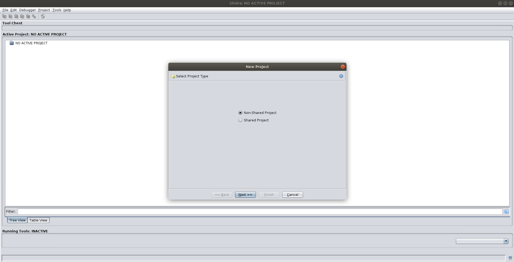
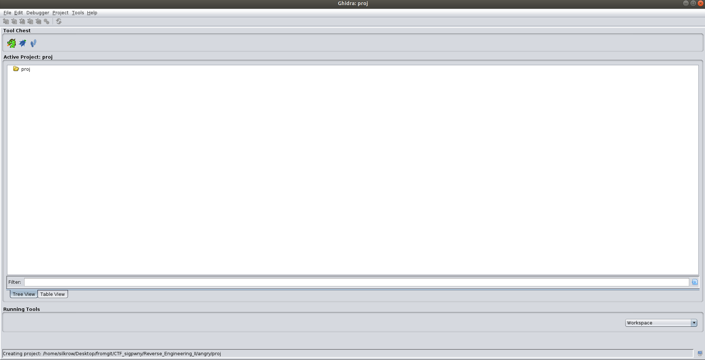
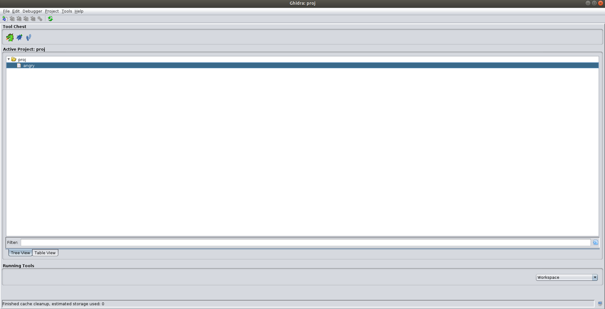
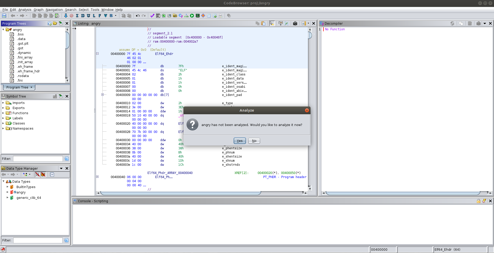

---
_Infact, I spent three days in the spring break to work on a single CTF problem, and ended with failure ..._

_This article gives a brief introduction to tools related with reverse engineering, including Ghidra, angr, Pin, and gdb python API with a concrete_ [CTF example](https://ctf.sigpwny.com/challenges#Meetings/angry-417)

---
# Motivation
Well, I believe you've at least heard about the term "reverse engineering". Reverse engineering is necessary when we want to investigate the behavior of an executable file without the access of its source code. 

When you're given an executable without source code, you may first try to run it with a debugger, since this would allow you to investigate the memory and registers during the execution, and set break points. However, if the executable was compiled without debugging information (stripped), then debugger can no longer be used to it. At this point, you may want to seek help from powerful **reverse engineering tools**. 

Since the executable would always contain **machine code** for the processor to execute, reverse engineering tools can guess the programming source code of an executable based on the machine codes. With the basic translation done by reverse engineering tools, we can manually refine the guessed source code and eventually have a better understanding of the behavior of the executable. 

In this blog post, I will briefly introduce some reverse engineering tools including **ghidra, angr,** and **Pin**. In the end, I will give an example of how to use Python within **gdb** to assistant reverse engineering. The tools and techniques will be introduced with a real CTF example. 
# CTF Example Description
I guess it might be helpful to introduce tools with examples. [Here](https://ctf.sigpwny.com/challenges#Meetings/angry-417)'s a good one, a CTF puzzle that worths 500 points on [sigpwny CTF website](https://ctf.sigpwny.com/). 


In fact, I've been playing CTF puzzles on sigpwny website for fun during the spring break, I gathered my solutions in a github [repo](https://github.com/silkrow/CTF_sigpwny). The puzzle I use as an example here cost me more than three days to solve... 

The puzzle is called *Angry*, which perfectly describes my feeling when trying to solve it. The executable takes a string in form ```sigpwny{..}``` and tells you if it's the right flag or not. 

**(#'O') Spoil Alert: I will introduce my solution to this CTF puzzle in the following post, if you want to figure it out by yourself, you have to stop reading RN :(**

# Start with Ghidra
To begin with, let's look at the file given to us. In case if the [sigpwny link](https://ctf.sigpwny.com/challenges#Meetings/angry-417) does not work, I've stored the file on my website, you can [click here](../backup_files/posts/intro-to-re-tools-with-an-angry-example/angry) to download the given executable called ```angry```.

First thing first, we may use ```file``` command in Linux to check the basic information of ```angry```. From the result shown below, we know ```angry``` is an executable in ELF format, it's **not stripped**, so we can use **gdb** to run it. 

	$ file angry
	angry: ELF 64-bit LSB executable, x86-64, version 1 (SYSV), dynamically linked, interpreter /lib64/ld-linux-x86-64.so.2, BuildID[sha1]=264818a1be1cdd674a24a74ad2ecaffbef7e21b1, for GNU/Linux 3.2.0, not stripped	

The tool we use to investigate the executable is called **[Ghidra](https://ghidra-sre.org/)**. Ghidra is developed by National Security Agency, it's [open sourced](https://github.com/NationalSecurityAgency/ghidra), written in Java. Ghidra provides a **neat GUI to generate guesses of source code base on executable**. 

I will not cover how to install **ghidra**, check [this video](https://www.youtube.com/watch?v=n8W7ROpvx58) by sigpwny might help you with that. 

Now start working with **ghidra**! First we launch it, click on **"File"** at top left and click on **"New Project"**, it should give you something like this,



Select **"Non-Shared Project"**, click on **"Next"**, then assign the project with an arbitrary directory and name, note that this directory isn't necessary to be the same place as where ```angry``` locates, you can pick wherever you like. After that, click on **"Finish"** and it should give you a new project like this (I named it just "proj"), 



Next, click on **"File"** at the top left, select **"Import File"** to import your executable (```angry``` in our example). There will be two windows pop up one after the other, just click the **"OK"** button for both of them. 

Then you will see something like this,



Now, double click on **"angry"** file, and start the reverse engineering journey!

Oops, a window pops up! Just click on **"Yes"** and click **"Analyze"** without changing any default settings to next pop up window.



Then, find the **"Symbol Tree"** panel, and find **"main"** in **"Functions"**, double click on that, it should give you something in the decompiler. 


Take a look at the decompiled result, it's the guessed C code generated automatically by ghidra based on the assembly it sees.

## References
1. [https://research.kudelskisecurity.com/2016/08/08/angr-management-first-steps-and-limitations/](https://research.kudelskisecurity.com/2016/08/08/angr-management-first-steps-and-limitations/)
2. [https://book.hacktricks.xyz/reversing-and-exploiting/reversing-tools-basic-methods/angr/angr-examples](https://book.hacktricks.xyz/reversing-and-exploiting/reversing-tools-basic-methods/angr/angr-examples)
3. [https://docs.angr.io/](https://docs.angr.io/)
4. [https://sourceware.org/gdb/onlinedocs/gdb/Python-API.html](https://sourceware.org/gdb/onlinedocs/gdb/Python-API.html)
5. [https://www.youtube.com/watch?v=xt9v5t4_zvE](https://www.youtube.com/watch?v=xt9v5t4_zvE)


--- 
# Drafts

layout:
	angr? 
	basic template
		official doc examples
	problem description
	how to solve it
		length=5 if replace call with hook 
	more angr techniques (2. reference, 1. for python debugging technique)


## How to put multiple inputs received by scanf (should use registers!)
https://book.hacktricks.xyz/reversing-and-exploiting/reversing-tools-basic-methods/angr/angr-examples#registry-values


