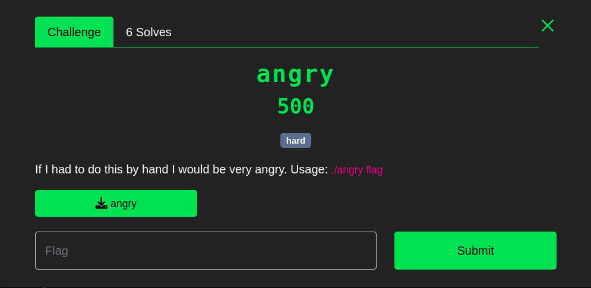
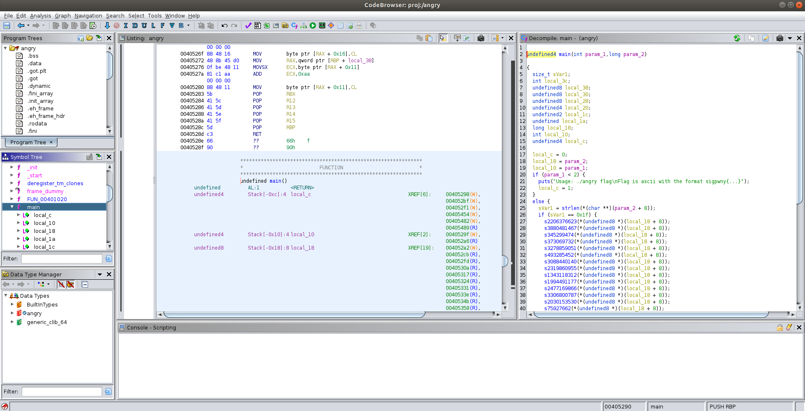

---
_As a beginner of reverse engineering, I spent three days in the spring break to work on a single CTF problem..._

_When trying to solve this_ [CTF problem](https://ctf.sigpwny.com/challenges#Meetings/angry-417), _I learnt three new techniques, angr, Pin, and gdb Python API._

_I'd like to share the approaches I made to solve this CTF problem in this post, hopefully give you an idea of how to deal with some easy reverse engineering problems. This is_ **not** _a tutorial of tools, but a walkthrough of how to analyze the information we gained from these tools. Nevertheless, I will include_ **links to tutorials** _for each tool I used, so that you can easily learn it by yourself._

**(#'O') Spoil Alert: I will introduce my solution to this CTF puzzle in the following post, if you want to figure it out by yourself, you have to stop reading RN :(**

---
# Problem Description
* Source: [https://ctf.sigpwny.com/challenges#Meetings/angry-417](https://ctf.sigpwny.com/challenges#Meetings/angry-417)
* Difficulty: **hard**
* Points: **500**
* Download File: [angry](../backup_files/posts/intro-to-re-tools-with-an-angry-example/angry) (I include this here just in case the link to sigpwny website doesn't work)





If you are only interested in the source codes I used to solve this CTF problem checkout my [repo](https://github.com/silkrow/CTF_sigpwny). 
# Start with Ghidra
---
Useful Links:
* [sigpwny presentation for ghidra installation](https://www.youtube.com/watch?v=n8W7ROpvx58)
* [sigpwny presentation for ghidra basic usage](https://www.youtube.com/watch?v=vKuui7iCOB0)
* [ghidra source code on Github](https://github.com/NationalSecurityAgency/ghidra)

---
First thing first, I used ***file*** command in Linux to check the basic information of ***angry***. From the result shown below, I knew ***angry*** was an executable in ELF format, it was **not stripped**, so I could use **gdb** to run it. 

	$ file angry
	angry: ELF 64-bit LSB executable, x86-64, version 1 (SYSV), dynamically linked, interpreter /lib64/ld-linux-x86-64.so.2, BuildID[sha1]=264818a1be1cdd674a24a74ad2ecaffbef7e21b1, for GNU/Linux 3.2.0, not stripped	

Then I used ghidra to further investigate the executable file. Ghidra is developed by **National Security Agency**, written in Java. It provides a **neat GUI to generate guesses of source code base on executable**. 

A typical screenshot of ghidra window is shown below,




After loading ***angry*** into ghidra, I took a look at the decompilation result of ***main*** function. Below is a copy of the raw result I got from ghidra,

```
undefined4 main(int param_1,long param_2)

{
  size_t sVar1;
  int local_3c;
  undefined8 local_38;
  undefined8 local_30;
  undefined8 local_28;
  undefined4 local_20;
  undefined2 local_1c;
  undefined local_1a;
  long local_18;
  int local_10;
  undefined4 local_c;
  
  local_c = 0;
  local_18 = param_2;
  local_10 = param_1;
  if (param_1 < 2) {
    puts("Usage: ./angry flag\nFlag is ascii with the format sigpwny{...}");
    local_c = 1;
  }
  else {
    sVar1 = strlen(*(char **)(param_2 + 8));
    if (sVar1 == 0x1f) {
      s2206376623(*(undefined8 *)(local_18 + 8));
      s3880481467(*(undefined8 *)(local_18 + 8));
      s345299474(*(undefined8 *)(local_18 + 8));
      s373069732(*(undefined8 *)(local_18 + 8));
      s3278859051(*(undefined8 *)(local_18 + 8));
      s493285452(*(undefined8 *)(local_18 + 8));
      s3088440140(*(undefined8 *)(local_18 + 8));
      s2319860955(*(undefined8 *)(local_18 + 8));
      s1343118312(*(undefined8 *)(local_18 + 8));
      s1994491177(*(undefined8 *)(local_18 + 8));
      s2477169866(*(undefined8 *)(local_18 + 8));
      s3306800787(*(undefined8 *)(local_18 + 8));
      s2030153530(*(undefined8 *)(local_18 + 8));
      s75927662(*(undefined8 *)(local_18 + 8));
      s1476774293(*(undefined8 *)(local_18 + 8));
      s2172966575(*(undefined8 *)(local_18 + 8));
      local_38 = 0x858712997682b1b4;
      local_30 = 0xdae67b2d46152991;
      local_28 = 0x8fb3a7e55077d4c3;
      local_20 = 0xfaec4847;
      local_1c = 0xcbd9;
      local_1a = 0x25;
      for (local_3c = 0; local_3c < 0x1f; local_3c = local_3c + 1) {
        if (*(char *)(*(long *)(local_18 + 8) + (long)local_3c) !=
            *(char *)((long)&local_38 + (long)local_3c)) {
          puts("That flag is incorrect.");
          return 0;
        }
      }
      puts("That flag is correct! Congrats.");
      local_c = 0;
    }
    else {
      puts("That flag is incorrect.");
      local_c = 0;
    }
  }
  return local_c;
}
```

From the first ***if*** statement in the ***main*** function, I learnt that the input to ***angry*** should be given as a command line argument. According to the second ***if*** statement, the correct input should be ***0x1f*** long, which is ***31*** in decimal. 

With these in mind, I knew that a valid input for ***angry*** should be something like this,

```
./angry 1234567890123456789012345678901
```

The string ***1234567890123456789012345678901*** above is just specifying that the input should be 31 characters, I like to use the numbers to control my input length :)

Back to the ***main***  function decompilation, after the program pass the second ***if*** statement, it makes a bunch of function calls on ***local_18 + 8***, which is the address of the input string. I clicked on the function names in ghidra, and investigated the decompilation results of these functions. All of them are just doing some modification on characters in the input string. Below is a snippet from the definition of the first function, ***s2206376623***,

```
void s2206376623(char *param_1)

{
  param_1[0x1c] = param_1[0x1c] + -0x25;
  param_1[2] = param_1[2] + 'X';
  param_1[0x13] = param_1[0x13] + -0x2e;
  param_1[0xb] = param_1[0xb] + '?';
  param_1[0xe] = param_1[0xe] + -0x1f;
  param_1[10] = param_1[10] + -0x4b;
  param_1[5] = param_1[5] + -0x37;
  param_1[0x1d] = param_1[0x1d] + -0x1e;
  param_1[0x17] = param_1[0x17] + -0x6d;
  param_1[10] = param_1[10] + 'y';
  param_1[0x1e] = param_1[0x1e] ^ 0xb2;
  param_1[0x13] = param_1[0x13] + -0xc;
  param_1[0x12] = param_1[0x12] ^ 0x35;
  *param_1 = *param_1 + '&';
  param_1[0x1b] = param_1[0x1b] + -0x20;
  param_1[0xc] = param_1[0xc] + -0x6b;
  param_1[1] = param_1[1] + '\x10';
  return;
}
```

The other functions called in ***main*** are all similar with this ***s2206376623***, they do arithmetic or logic operations on the characters, so that input string will be **"encoded"** by some comlicated rules.

After the list of function calls, within the second ***if*** statement, there are some local variable definitions, I didn't find them to be useful. I jumped right into the for loop, since it was clearly the key component in this problem. Below is a copy of the for loop snippet from ***main*** function,

```
      for (local_3c = 0; local_3c < 0x1f; local_3c = local_3c + 1) {
        if (*(char *)(*(long *)(local_18 + 8) + (long)local_3c) !=
            *(char *)((long)&local_38 + (long)local_3c)) {
          puts("That flag is incorrect.");
          return 0;
        }
      }
      puts("That flag is correct! Congrats.");
      local_c = 0;
    }

```

Obviously, the for loop compares the **"encoded"** input string with some hidden string character by character, and sends an error message whenever a pair of inequal characters appear. If the for loop is safely passed, there will be a congrat message which indicates the input string is the correct flag.

Up to now, here's a flow chart I concluded for the behavior of ***angry***.

```
    command line input
            ||
            ||
            \/
      two arguments?      ---- No ----> Incorrect
            ||
           Yes
            ||
            \/
    flag length == 31?    ---- No ----> Incorrect
            ||
           Yes
            ||
            \/
       ------------
       | blackbox |
       | encode   |
       | each     |
       | char     |
       | in the   |
       | flag     |
       ------------
            ||
            ||
            \/
 for (i = 0; i < 31; i++) ---- encoded_flag[i] != hidden_str[i] --> Incorrect
            ||
      for loop ended
            ||
            \/
         Congrats!
```

It's quite straight forward! In fact, as long as I give ***angry*** a 31-character string as command line argument, the first two "Incorrect" conditions won't be triggered. The third "Incorrect" condition can be found inside the **for loop**, since whenever **if** statement is true, the program will **puts** the message and return, so the **puts** function call in **if** statement can be seen as a mark of **incorrect flag**. Correspondingly, the **puts** function call after the for loop which prints the congratulation message can be seen as a mark of **correct flag**.

With the **incorrect flag** and **correct flag** in mind, I used ghidra to find out the addresses of these two **puts** calls. Find the addresses were easy, just left click on the source code and ghidra will high light the corresponding assembly instruction for you in the assembly window. 

* incorrect address = 0x0040544f
* correct address = 0x0040547d

My goal was then to let the program avoid hitting on ***incorrect address***, and try to reach ***correct address***. To acheive that, I used a tool called **"angr"**.

# Find & Avoid with angr


## References
1. [https://research.kudelskisecurity.com/2016/08/08/angr-management-first-steps-and-limitations/](https://research.kudelskisecurity.com/2016/08/08/angr-management-first-steps-and-limitations/)
2. [https://book.hacktricks.xyz/reversing-and-exploiting/reversing-tools-basic-methods/angr/angr-examples](https://book.hacktricks.xyz/reversing-and-exploiting/reversing-tools-basic-methods/angr/angr-examples)
3. [https://docs.angr.io/](https://docs.angr.io/)
4. [https://sourceware.org/gdb/onlinedocs/gdb/Python-API.html](https://sourceware.org/gdb/onlinedocs/gdb/Python-API.html)
5. [https://www.youtube.com/watch?v=xt9v5t4_zvE](https://www.youtube.com/watch?v=xt9v5t4_zvE)


--- 
# Drafts

layout:
	angr? 
	basic template
		official doc examples
	problem description
	how to solve it
		length=5 if replace call with hook 
	more angr techniques (2. reference, 1. for python debugging technique)


## How to put multiple inputs received by scanf (should use registers!)
https://book.hacktricks.xyz/reversing-and-exploiting/reversing-tools-basic-methods/angr/angr-examples#registry-values


