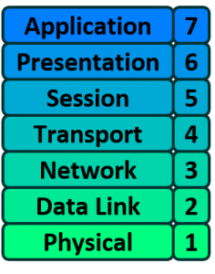

# 前言
最近在图书馆看到一本《VPNS A BEGINNER'S GUIDE》，比较有趣。该书的前半部分用于简单罗列一些计算机网络相关的知识点，后半部分讲VPN相关知识。由于鄙人自知本科计网课程学得极度不扎实，于是打算借此机会回顾一遍相关知识点并用这篇博客记录。由于计算机网络相关知识点太多（各种协议），本篇不会尝试记录所有细节（我脑子也记不住），只是将对应的知识点写在对应的栏目下方便日后查阅，并简单概括一下自己的理解。日后应该会不断将本书外学到的相关知识也在这篇博客里补充，但愿它可以变得臃肿而有意义吧。

# 目录
* TOC
{:toc}

# 网络模型概览
## OSI
OSI指Open System Interconnection，即常说的7层网络模型。

OSI模型的普及是由美国政府在上世纪90年代促成的。下面自底向上罗列一下每一层的作用概括以及相关协议名称。
1. **Physical Layer**: 传输介质所在，数据以bits形式流通，RJ-45规则声明了cable中使用的链接器以及引脚。Ethernet和IEEE 802.3在这一层定义了网线的使用规则（数据如何通过网线传输）。
2. **Data Link Layer**: 处理physical addressing，负责某段网线上传输的packets（例如一个packet需要经过多条网线到达目的地，而这一层只关心其中的每一段网线而非全程）。当然本层会涉及网络的拓扑结构，error control，frame sequencing和flow control。相关协议有Frame Relay, HDLC, PPP (Point to Point Protocol), FDDI, ATM (Asynchronous Transfer Mode), IEEE 802.3 (Ethernet使用), IEEE 802.5。
3. **Network Layer**: 处理logical addressing。涉及协议有IP, IPX (Internetwork Packet Exchange), BGP, OSPF, RIP (Routing Information Protocol)。
4. **Transport Layer**: 涉及connection oriented或connectionless的端到端传输，这层一般用segment称呼数据。由于是负责数据传输，会涉及flow control, multiplexing, error checking和recovery。相关协议有TCP, UDP, SPX (Sequence Packet Exchange)。
5. **Session Laye**: 也叫port layer。负责两台机器间通讯的建立和管理。对于上层的layer而言，本层不仅提供了数据传输，且提供了一些基于数据传输的服务，例如远程登录、远程文件传输。本层也提供synchronization，例如一个长达两小时的文件传输在一小时后因网络原因中断，synchronization会保证在下次重新传输时仅传输剩余部分数据。相关协议包括RPC, SQL, NetBIOS, ASP (AppleTalk Session Protocol)。
6. **Presentation Layer**: 确保了向上层提供的数据是上层所在的应用可读的（翻译官）。同时负责数据加密、压缩和不同格式字符的转换。相关的协议有GIF, JPEG, TIFF, ASCII, MPEG, HTML。
7. **Application Layer**: 负责应用软件与网络交互。相关协议有HTTP, FTP, NFS, SMTP, SNMP (Simple Network Management Protocol)。