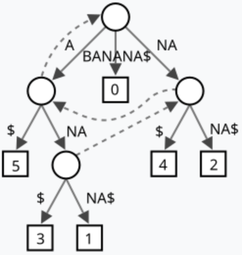

This is an introduction to the concepts related to trie (prefix tree) and suffix tree.

# Table of Contents
* TOC
{:toc}

# Overview
**Trie** (also known as prefix tree) is a search tree that stores a whole dictionary with the prefix of words. A **suffix tree** is a compressed trie that contains all the suffixes of **a given string**.

# Trie
Trie (AKA prefix tree) is nothing but a dictionary tree. Each node in trie holds a letter, a path from root to a node in trie represents a word stored in trie (if the terminating node has a field indicating storage).

A straight-forward example of a trie:

          (root)
           /  \
         c     d
        /       \
       a         o
      /|\        |
     t r p       r
                 |
                 m

Note that in a dictionary tree, the leaf nodes (and some non-leaf nodes) will store a value (e.g. address of this word), for trie, this value can be replaced with a termination mark if you want to store only the strings themselves. 

## Time Complexity
| Insertion | Search | Deletion|
|------------------|-----------------|-----------------|
| O(n)    | O(n)   | O(n)    |

Where *n* is the length of the string.

## Compressed Trie
An alternative way of implementation can be used to save space. The idea is to store letter sequence rather than single letter whenever possible (greedy way). 

          (root)
           /  \
         c     dorm
        /|\       
      at ar ap  

# Suffix Tree
Suffix tree is a compressed trie. Unlike trie which stores multiple strings, the subject of a suffix tree is just **one string**, meanwhile, the suffix tree stores not only this string itself, but also all of its suffixes.

An example of a suffix tree for string "BANANA":

A pretty straight-forward application of suffix tree is in the string pattern matching. Suppose you want to find pattern string *p* in another string *s*, instead of using KMP algorithm, you can construct the suffix tree of string *s*, and then search *p* in the suffix tree to find the occurrences. Suffix tree is also used in DNA or protein sequence searches and data compression due to its ability to search with mismatches and search repeated data.

## Ukkonen's Algorithm
A suffix tree can be constructed using Ukkonen's algorithm. The main idea of the algorithm is to iterate through the prefixes of the string starting from the shortest one. In the iteration, an implicit suffix tree is constructed on top of the implicit suffix tree built in the previous iteration. Suffix links are used during construction. 