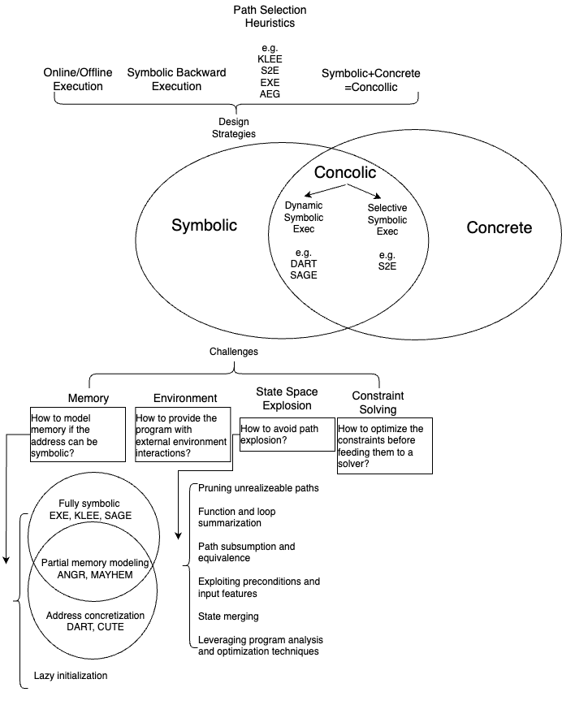

This blog presents a growing collection of papers and tools related to the topic of symbolic execution. I (hopefully ;p) plan to update it regularly, since I want it to serve as a handy index whenever I revisit this topic. 

For each paper or tool listed here, I’ll include a link to a separate page with my notes from reading or studying it. The notes are definitely not *complete*, but I do aim for them to be *sound* (hopefully!).

I collected the related papers by refering to the following surveys/summaries:
1. *A Survey of Symbolic Execution Techniques*, Baldoni et al. [[link](https://arxiv.org/pdf/1610.00502)]
2. *Symbolic execution for software testing: Three decades later*, Cadar et al. [[link](https://people.eecs.berkeley.edu/~ksen/papers/cacm13.pdf)]

# List of Paper Notes
1. [Symbolic execution for software testing: Three decades later](/paper_notes/2025-04-20-Symbolic-execution-for-software-testing-Three-decades-later)(2013)
1. [A Survey of Symbolic Execution Techniques](/paper_notes/2025-04-20-A-Survey-of-Symbolic-Execution-Techniques)(2018)
1. [DART: directed automated random testing](/paper_notes/2025-04-22-DART-Directed-Automated-Random-Testing)(2005)
1. [CUTE: A Concolic Unit Testing Engine for C](/paper_notes/2025-04-22-CUTE-A-Concolic-Unit-Testing-Engine-for-C)(2005)
3. [EXE: Automatically Generating Inputs of Death](/paper_notes/2025-04-21-EXE-Automatically-Generating-Inputs-of-Death)(2006)
4. [KLEE: Unassisted and Automatic Generation of High-Coverage Tests for Complex Systems Programs](/paper_notes/2025-04-22-KLEE-unassisted-and-automatic-generation-of-high-coverage-tests-for-complex-systems-programs)(2008)
5. [Coyote C++: An Industrial-Strength Fully Automated Unit Testing Tool](/paper_notes/2025-04-22-Coyote-C-An-Industrial-Strength-Fully-Automated-Unit-Testing-Tool)(2023)

# High-Level View

After skimming the survey *A Survey of Symbolic Execution Techniques*, I summarized the topics related to symbolic execution as the diagram below.

# Symbolic Execution Tools Overview in 2013 Survey
When skimming the survey *Symbolic execution for software testing: Three decades later* I came accross a section named "Tools" which listed many symbolic execution tools with a brief introduction. I summarized them as below:

1. **DART**: The first concolic testing tool that combines dynamic test generation with random testing and model checking techniques with the goal of systematically executing as many as possible execution paths of a program. DART was first implemented at Bell Labs for **testing C programs**, and has inspired many other extensions and tools since.
2. **CUTE**: Extends DART to handle **multithreaded programs** that manipulate dynamic data structures using pointer operations. Developed at UIUC for **C and Java programs** (jCUTE is dedicated to Java).
3. **CREST**: An open-source tool for concolic testing of **C programs**. It is an extensible platform for building and experimenting with heuristics for selecting which paths to explore.
4. **EXE**: A symbolic execution tool for **C programs** designed for comprehensively testing complex software, with an empasis on **systems code**. EXE models memory with bit-level accuracy. EXE provides the speed necessary to quickly solve the constraints generated by real code, through a combination of **low-level optimizations implemented in its purposely designed constraint solver STP**, and a series of higher-level ones such as caching and irrelevant constraint elimination.
5. **KLEE**: A redesign of EXE, built **on top of the LLVM-compiler infrastructure**. It performs concolic execution, models memory with bit-level accuracy, employs a variety of solving optimizations, and uses search heuristics to get high code coverage. one of the key improvements of KLEE over EXE is its ability to store a much larger number of concurrent states, by exploiting sharing among states at the object-level rahter than at the page-level. KLEE also has better environment interaction than EXE. 
6. **SAGE**: A dynamic symbolic execution tool developed by Microsoft for x86 binaries.

# Advanced Directions by 2018 Survey
*A Survey of Symbolic Execution Techniques* was published in 2018. In the survey, some further directions for symbolic execution were listed. Below is a summarized version.

1. **Separation Logic**: SL extends Hoare logic to facilitate reasoning about programs that maniputlate pointer data structures, and allows expressing compplex invariants of heap configurations in a succinct manner.
2. **Invariants**: Leveraging invariants of loops can be beneficial to symbolic executors, there was no relavent work discoverd by the authors of the survey.
3. **Function Summaries**: Calysto static checker is an example of using the call graph to construct a symbolic representation of effects on each function.
4. **Program Analysis and Optimization**: The developments in programming languages realm could be beneficial to symbolic execution. Some examples are loop coalescing, loop unfolding, program synthesis.
5. **Symbolic Computation**: Only Z3 and SMT-RAT can reason about non-linear real and integer arithmetic. The developments in symbolic computation can be used to help SMT solvers. SC^2 is an interesting project aiming to bridge the gap between symbolic computation and satisfiability checking.