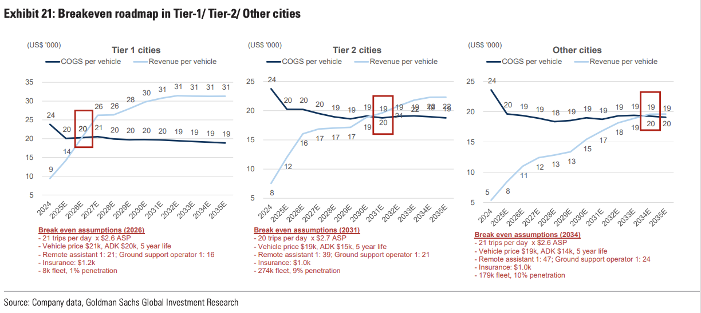
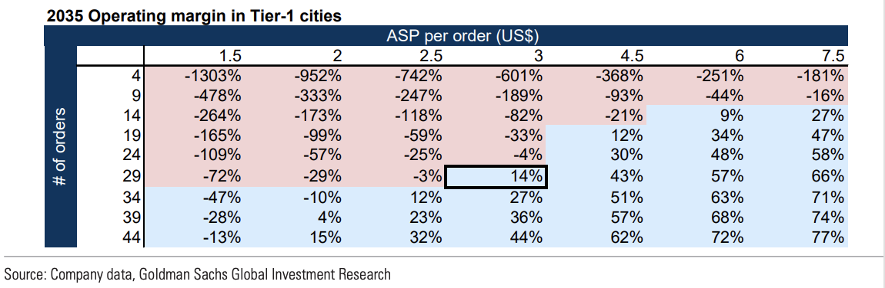
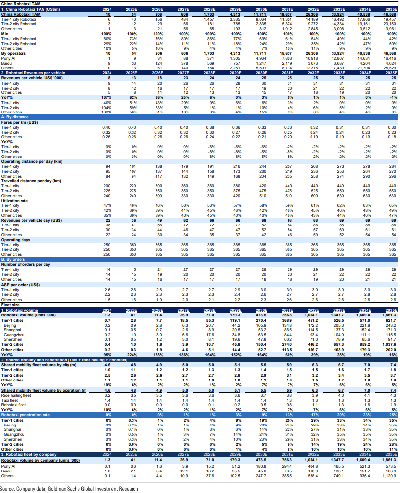
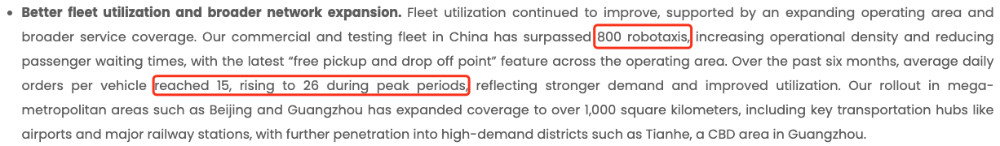

本篇文章主要是对2025年高盛的一篇文章[China's Robotaxi market - the road to commercialization](https://www.goldmansachs.com/pdfs/insights/goldman-sachs-research/robotaxi/report.pdf)的提炼总结，以供日后参考。

# TAM预测
首先，TAM (Total Addressable Market)指的是当一家公司获取了100%的市场时，能得到利润。

高盛的预测是中国的Robotaxi TAM将在**2035年达到47亿美元**，同时他们对2025年的TAM评估是**5千4百万美元**（相当于10年870倍的增长）。

一些主要的乐观预测是：
1. 硬件和算法的成本会逐渐降低。
2. Robotaxi会逐渐将车辆转变为娱乐中心或者私密的办公场所，这些角色都能吸引更多消费者。
3. 政策支持以及更多的城市开放营业执照。
4. 单车转盈利，会吸引更多供应商（预测2035年底每辆车在一线城市的年收益是$31,000）。

# 车队规模预测
2025年底，中国有约4,000辆Robotaxi，高盛预测在2025年底国内将有约1,900,000辆。其中一线城市（北上广深）会在2035年底达到约474,000辆，且近一半属于Pony AI。

# 订单及利润预测
订单方面，2025年底每天约15单，2035年底预计在一线城市达到29单，其他城市约22单（我查了一下2026年初Waymo在美国范围6个城市内有近3000辆车，每周订单有400,000以上，平均每辆车的日订单有19。而AI通过搜索得出的估算都在23和24左右，因此高盛对中国一线城市2035年车均日订单的预测是完全可以达到的）。

价格方面，对于**一线城市**，预计2035年底平均的订单价格(ASP, Average Selling Price)是3美元，这个数字在2025年底是2.5美元左右。同时对每公里收费的预测是2035年底每公里0.3美元，这个数字在2025年底是0.4美元。另外，2025年底每日的运作行程（不包括空转）有101km左右，预计在2035年底达到284km。

综合下来，2025年底全国范围内每辆车每天收入是36美元，而2035年底预测达到69美元。每辆车的年收入在2025年底是13,000美元，预测在2035年底达到25,000美元（两个数字的增长都是1.9倍多）。而对于**一线城市**，2025年底的每车日均收入为41美元，年收入为14,200美元，到2035年底预测日收入为86美元，年收入为31,300美元。

成本方面，高盛预测车辆成本降低，而运营成本增加，在**一线城市**中每辆车的年均成本在2025年底是20,100美元，预计到2035年底达到18,900美元。

因此，在**一线城市**每辆车会有如下变化：
1. 2025年利润 = $14,200 - $20,100 = -$5,900
2. 2035年利润 = $31,300 - $18,900 = $12,400

这些数字详见文末的表格截图。

还有一个数字是，传统的出租车日均的收入是$28-56。

# 市场玩家
高盛预测中国的Robotaxi总数量由2025年的4100到2035年的1,900,000辆。现有的Pony AI, WeRide, Baidu Apollo都还会是主要玩家。

# 整体份额
高盛预测2035年底国内道路上的出租车辆占比Robotaxi将达到25%，剩下17%为传统出租车，58%为网约车。这个数字在2025年底还是不到1%。预测在2030年底达到9%。

# 时间点
2026，2031，2034分别是一线，二线，其他城市的盈利时间点。

# 风险预测
首先，Robotaxi的盈利与否很大地取决于每日的订单量以及订单均价。从下图对一线城市的预测就可以看出，高盛的2035年一线城市日均29单每单3美元也是勉勉强强达到盈利区间。

一个很不稳定的因素是**市场竞争**对利润的影响，国内目前只有很少的Robotaxi玩家，但这个数量一定会随着有利可图而骤升（大的科技公司，传统的自动驾驶公司以及打车平台都会想入场）。一旦有竞争导致日均单量或订单均价达不到要求，就无法盈利。

另一个不稳定因素是交通事故带来的信任危机。

# 个人总结
本篇文章在2026年3月末完成，而高盛的分析是在2025年5月6日发布。因此可以对报告中关于2025年底的预测数据进行初步验证。另外2026年的年底也将是一个关键时间点，报告中预测**一线城市**的Robotaxi将快速盈利，我们拭目以待！

# 详细TAM表格

# 补充
WeRide在3月23日发布财报，显示数据是有800辆Robotaxi，日均每辆车的订单为15，最高为26。

PonyAI在3月26日发布财报，显示数据是有1400辆Robotaxi，日均每辆车的订单最高为25。

# 参考资料
1. [China's Robotaxi market - the road to commercialization](https://www.goldmansachs.com/pdfs/insights/goldman-sachs-research/robotaxi/report.pdf)
2. [WeRide Reports Record Full Year 2025 Revenue of RMB684.6 Million, Up 90% Year over Year](https://ir.weride.ai/news-releases/news-release-details/weride-reports-record-full-year-2025-revenue-rmb6846-million-90)
3. [PONY AI Inc. Scales with 160% Robotaxi Revenues Growth YoY and 500%+ Fare-Charging Revenues Surge YoY in Q4, Targeting Deployment in 20+ Cities by Year-End](https://ir.pony.ai/node/8016/pdf)
