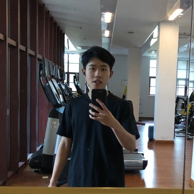

I'm a second-year master's student majoring in computer science at UIUC. I'm currently conducting research on software testing and operating system testing under the supervision of my advisor, Professor [Darko Marinov](https://mir.cs.illinois.edu/marinov/).    

## A Photo of myself

## Contact me
erkaiyu2 at illinois dot edu

## Working Experience
* Momenta, Research and Development Intern
    * Feb 2024 - Jun 2024
    * Shanghai, China

## Teaching Experience
* Teaching Assistant, CS 101: Introduction to Programming for Scientists and Engineers, UIUC       
    * FA24, SP25, FA25
* Teaching Assistant, ECE 220: Computer Systems and Programming, ZJUI
    * SP24
* Teaching Assistant, CS 101: Introduction to Programming for Scientists and Engineers, ZJUI       
    * FA23 
* Course Assistant, ECE 391: Computer Systems Engineering, UIUC
    * SP23